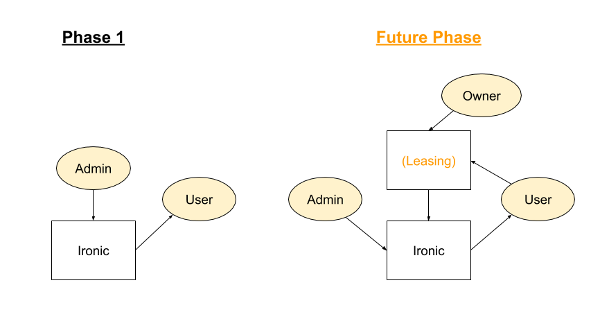

# ESI Design

This document describes the design of ESI a baremetal leasing and provisioning service that is the proposed replacement for HIL/BMI. Requirements are described in [a separate document](esi-requirements.md).

The primary goals of this architecture are:

* Enforce project isolation in the usage of baremetal nodes and their associated components (networks, volumes, etc)

* Ensure that functional workflows are decoupled from each other

    * For example, the leasing and provisioning workflows should be designed so that alternate provisioning workflows can be used

OpenStack is an ideal platform to accomplish these goals. There are several reasons why:

* OpenStack already has a strong project focus, with a proven identity service (Keystone) that has tight integration with all OpenStack services

* OpenStack already has a service for managing baremetal hardware

* OpenStack has a robust suite of APIs for managing infrastructure

* OpenStack is designed so that its services can be used together or standalone

* OpenStack is open source, allowing development of needed features

This document describes the operations and workflows that ESI will allow. It also highlights which operations can be performed by existing OpenStack commands, and which require engineering work to close the gap.

# Development Phases

Initial development will focus on creating a platform that achieves parity with HIL/BMI. It will focus on the following:

* Identity (Keystone)

    * Specify administrator, users, and projects

* Isolation (Ironic)

    * Manage a baremetal node inventory

    * Allow admins to assign nodes to a user

* Network (Neutron)

    * Allow admins to create public networks

    * Allow users to create project networks

    * Allow fine-grained access control for networks

* Image (Glance)

    * Allow admins to create public images

    * Allow users to create private images

    * Allow fine-grained access control for images

* Provisioning (Nova)

    * Allow users to provision upon assigned nodes

* Maintenance (Ironic)

    * Allow users to control the power state of an assigned node

    * Allow users to view the serial console of an assigned node

    * Allow users to create an image from an assigned, provisioned node

    * Allow users to create a snapshot from a boot volume

Future phases will build upon this initial work, focusing on:

* A new OpenStack leasing service that provides fine-grained control over the isolation workflow:

    * Allow nodes to be leased to a user for a specific time period through a contract

    * Allow node owners to offer up their nodes for others to claim

    * Allow users to claim nodes and create their own contracts

* Additional provisioning options

    * Provide access to additional provisioning workflows through the OpenStack API

    * Allow users to use their own provisioning systems

# Roles

* **Administrator:** Controls access to nodes; creates public images, flavors, and networks for all Users; has complete API access to all of ESI.

* **Owner:** Controls access to their own nodes. This capability may not be part of Phase 1.

* **User:** Assigned nodes; creates private images, flavors, and networks; provisions nodes

* **Service:** A role for automated operations, such as the creation of User volumes

# Operations

This section describes the operations that ESI will support. Each operation is tagged to indicate the development state of that feature using one of the following tags:

<table>
  <tr>
    <td>😀</td>
    <td>Operation is supported by existing code</td>
  </tr>
  <tr>
    <td>🙂</td>
    <td>Operation is unsupported, but requirements are known</td>
  </tr>
  <tr>
    <td>🤔</td>
    <td>Additional research is required to determine the state of this operation</td>
  </tr>
  <tr>
    <td>😬</td>
    <td>This operation will be part of future development work</td>
  </tr>
</table>

Feature gaps will be closed in one of the following ways:

* Adding needed functionality upstream

* Developing a leasing service

* Writing scripts (shell, ansible playbook) to encompass multiple OpenStack commands

    * Note that any such scripts will still only use upstream OpenStack APIs

## Identity Operations

ESI is constructed entirely from OpenStack services; as a result, we can rely on Keystone to provide all our Identity needs:

<table>
  <tr>
    <td></td>
    <td>Service</td>
    <td>Role</td>
    <td>Function</td>
    <td>OpenStack Command</td>
  </tr>
  <tr>
    <td>😀</td>
    <td>Keystone</td>
    <td>Admin</td>
    <td>Create a project</td>
    <td>openstack project create</td>
  </tr>
  <tr>
    <td>😀</td>
    <td>Keystone</td>
    <td>Admin</td>
    <td>Create a user</td>
    <td>openstack user create</td>
  </tr>
  <tr>
    <td>😀</td>
    <td>Keystone</td>
    <td>Admin</td>
    <td>Assign users to a project</td>
    <td>openstack user create (specify a project)
openstack role add</td>
  </tr>
</table>

## Isolation Operations

After an Admin adds a baremetal node to inventory, an Admin can directly assign a User to the node. Note that Ironic currently does not support project isolation; that is a feature we will add.

<table>
  <tr>
    <td></td>
    <td>Service</td>
    <td>Role</td>
    <td>Function</td>
    <td>OpenStack Command</td>
  </tr>
  <tr>
    <td>😀</td>
    <td>Ironic</td>
    <td>Admin</td>
    <td>Add/remove a node from inventory</td>
    <td>openstack baremetal node create/delete</td>
  </tr>
  <tr>
    <td>🙂</td>
    <td>Ironic</td>
    <td>Admin</td>
    <td>Assign node to a project</td>
    <td>openstack baremetal node set --owner
Ironic needs to respect owner field</td>
  </tr>
  <tr>
    <td>🤔</td>
    <td>Ironic</td>
    <td>Admin</td>
    <td>Unassign node from a project</td>
    <td>openstack baremetal node unset --owner
Ironic needs to respect owner field
What happens to provisioned node?</td>
  </tr>
</table>

In the future we will develop a leasing service that builds upon Ironic’s isolation capabilities to provide fine-grained leasing options: 

<table>
  <tr>
    <td></td>
    <td>Service</td>
    <td>Role</td>
    <td>Function</td>
    <td>OpenStack Command</td>
  </tr>
  <tr>
    <td>😬</td>
    <td>(Leasing)</td>
    <td>Owner</td>
    <td>Create an offer for a node</td>
    <td>Leasing service needs a CLI
We need an option to disable ‘owner’ checking</td>
  </tr>
  <tr>
    <td>😬</td>
    <td>(Leasing)</td>
    <td>User</td>
    <td>View available offers</td>
    <td>Leasing service needs a CLI</td>
  </tr>
  <tr>
    <td>😬</td>
    <td>(Leasing)</td>
    <td>User</td>
    <td>Create a contract for a node</td>
    <td>Leasing service needs a CLI
Is there a way to specify max-contract time?
Is it okay to skip the bid/matcher process?</td>
  </tr>
  <tr>
    <td>😬</td>
    <td>(Leasing)</td>
    <td>User</td>
    <td>View contracted nodes</td>
    <td>Leasing service needs a CLI</td>
  </tr>
  <tr>
    <td>😬</td>
    <td>(Leasing)</td>
    <td>Owner</td>
    <td>Cancel a contract</td>
    <td>Leasing service needs a CLI</td>
  </tr>
  <tr>
    <td>😬</td>
    <td>(Leasing)</td>
    <td>Owner</td>
    <td>Cancel an offer</td>
    <td>Leasing service needs a CLI
What happens to contracted node?</td>
  </tr>
</table>

The following diagram details the isolation workflow for both Phase 1 and for future phases.

## Network Operations

ESI allows Admins to create public networks that can be used by any User. It also allows Users to create private networks which they can share with other Users.

<table>
  <tr>
    <td></td>
    <td>Service</td>
    <td>Role</td>
    <td>Function</td>
    <td>OpenStack Command</td>
  </tr>
  <tr>
    <td>😀</td>
    <td>Neutron</td>
    <td>Admin</td>
    <td>Create public network</td>
    <td>openstack network create --share</td>
  </tr>
  <tr>
    <td>🤔</td>
    <td>Neutron</td>
    <td>User</td>
    <td>Create a project network from a pool of valid VLANs allocated by Admin</td>
    <td>Are the existing Neutron network creation options enough?
Do we need to lock some options (--share)?
Much may be covered by policy - for example, by default, non-admins cannot created shared networks</td>
  </tr>
  <tr>
    <td>😀</td>
    <td>Neutron</td>
    <td>User</td>
    <td>Grant access to a project network to another project</td>
    <td>Create network (not shared by default)
openstack network rbac create --target-project <project> --action access_as_shared --type network <network>
Need to be careful what API is exposed to ‘shared’ projects: https://docs.openstack.org/ocata/config-reference/networking/samples/policy.json.html</td>
  </tr>
  <tr>
    <td>🙂</td>
    <td>Neutron</td>
    <td>Admin</td>
    <td>Configure network switches</td>
    <td>openstack network ??
Requires ansible-networking work to integrate it into Neutron</td>
  </tr>
</table>

## Image Operations

ESI also allows Admins to create images that can be used by any User. Users can also create private images which can be shared with other Users.

<table>
  <tr>
    <td></td>
    <td>Service</td>
    <td>Role</td>
    <td>Function</td>
    <td>OpenStack Command</td>
  </tr>
  <tr>
    <td>😀</td>
    <td>Glance</td>
    <td>Admin</td>
    <td>Create images, public and private</td>
    <td>openstack image create --public/private</td>
  </tr>
  <tr>
    <td>😀</td>
    <td>Glance</td>
    <td>Admin</td>
    <td>Share image with a User</td>
    <td>Create image as --shared
openstack image add project <image id> <project>
<project> user runs: openstack image set --accept <image id></td>
  </tr>
  <tr>
    <td>😀</td>
    <td>Glance</td>
    <td>User</td>
    <td>Create project image</td>
    <td>Note that some options, such as creating a public image, are locked from non-admins by default</td>
  </tr>
  <tr>
    <td>😀</td>
    <td>Glance</td>
    <td>User</td>
    <td>Grant access to a project image to another project</td>
    <td>Create image as --shared
openstack image add project <image id> <project>
<project> user runs: openstack image set --accept <image id></td>
  </tr>
</table>

## Provisioning Operations

Provisioning a node is often a two-step process. The first is to ensure that any needed network configuration is completed. This may require a User to create an Admin request for operations such as configuring network switches.

Once that is done, the provisioning workflow is controlled by the User and can only be performed upon assigned nodes. There are two flavors of provisioning workflows. The first takes advantage of the OpenStack API, and for Phase 1 only Nova will be supported.

<table>
  <tr>
    <td></td>
    <td>Service</td>
    <td>Role</td>
    <td>Function</td>
    <td>OpenStack Command</td>
  </tr>
  <tr>
    <td>🤔</td>
    <td>Nova</td>
    <td>User</td>
    <td>Provision a node</td>
    <td>openstack server create <options>
A new scheduler filter is needed that respects Ironic’s owner field</td>
  </tr>
</table>

Future work allows a User further flexibility through OpenStack APIs:

<table>
  <tr>
    <td></td>
    <td>Service</td>
    <td>Role</td>
    <td>Function</td>
    <td>OpenStack Command</td>
  </tr>
  <tr>
    <td>😬</td>
    <td>Cinder</td>
    <td>Service</td>
    <td>Set up ISCSI target (backed by Ceph RBD) for nodes to boot from</td>
    <td>BMI automatically does this when user starts to provision their leased node</td>
  </tr>
  <tr>
    <td>😬</td>
    <td>Ironic</td>
    <td>User</td>
    <td>Set boot device of a leased node (PXE or disk)</td>
    <td>Need to research this</td>
  </tr>
  <tr>
    <td>😬</td>
    <td>Ironic</td>
    <td>User</td>
    <td>Boot a leased node from an image or snapshot</td>
    <td>Lars has done this, need to replicate</td>
  </tr>
  <tr>
    <td>😬</td>
    <td>Ironic</td>
    <td>User</td>
    <td>Connect a project network to a leased node’s NIC</td>
    <td>Can almost definitely be done through Ironic?
openstack port create…
openstack baremetal node vif attach
Need to add support for flexible Ironic policies around Ironic port and node VIF APIs</td>
  </tr>
  <tr>
    <td>😬</td>
    <td>Cinder</td>
    <td>User</td>
    <td>Boot leased node from volume</td>
    <td>?? https://docs.openstack.org/ironic/pike/admin/bo
ot-from-volume.html ??</td>
  </tr>
  <tr>
    <td>😬</td>
    <td>Glance/ Nova</td>
    <td>User</td>
    <td>Provision image to leased node and boot it from local disk</td>
    <td></td>
  </tr>
  <tr>
    <td>😬</td>
    <td>Ironic</td>
    <td>User</td>
    <td>Attach network to node and power it on</td>
    <td></td>
  </tr>
</table>

The second flavor of provisioning allows for a User to use their own provisioning system. This can be as straightforward as the following:

1.  User asks an Admin to create a provider network representing the User’s provisioning network

2. User connects assigned node to provider network 

## Maintenance Operations

Maintenance operations provide various utilities for a User:

<table>
  <tr>
    <td></td>
    <td>Service</td>
    <td>Role</td>
    <td>Function</td>
    <td>OpenStack Command</td>
  </tr>
  <tr>
    <td>🙂</td>
    <td>Ironic</td>
    <td>User</td>
    <td>Control power state of leased node</td>
    <td>openstack baremetal node reboot/power
Requires owner policy spec to be implemented</td>
  </tr>
  <tr>
    <td>🤔</td>
    <td>Ironic</td>
    <td>User</td>
    <td>View serial console of a leased node (read only)</td>
    <td>It’s been done, needs to be documented
Is it sufficient?</td>
  </tr>
  <tr>
    <td>🤔</td>
    <td>Ironic/ Glance</td>
    <td>User</td>
    <td>Create image from a leased, provisioned node</td>
    <td>Unknown</td>
  </tr>
  <tr>
    <td>🤔</td>
    <td>Cinder</td>
    <td>User</td>
    <td>Create snapshot from boot volume</td>
    <td>Unknown</td>
  </tr>
</table>

# OpenStack Configuration and Deployment

OpenStack has a host of configuration and deployment options. ESI will include documentation on how to configure and deploy an OpenStack installation that can fulfill ESI requirements. We will also provide configuration and deployment scripts if possible.

# Usage Guide

OpenStack’s rich suite of APIs can be difficult to navigate, especially for people with little OpenStack experience. In order to alleviate that issue we will create a usage guide that highlights the OpenStack commands needed for common workflows.

In addition, if it is common practice to run a series of OpenStack commands for a particular workflow, we may wrap those commands in a shell script or Ansible playbook to allow for streamlined usage.
